# Guia de Expressões Regulares

**Regex**, **Expressões Regulares** ou **Regular Expression** são padrões utilizados para identificar determinadas combinações caracteres 

## Tabela Resumo

|Caractere|Ação de Captura|
|:---:|:-----|
|.| representa qualquer caracter menos "\n"|
|\\.| escapando o caractere "."|
|[ ]| representa qualquer valor contido dentro (conjunto de possibilidades)|
|^| representa o inicio da string|
|$| representa o final da string|
|[^]| diferente de um caractere|
|\w| é alfanumérico (não considera caracteres latinos como "ç" e "ã")|
|\W| não é alfanumérico|
|\s| caracter vazio|
|\S| caracter NÃO vazio|
|\d| números de 0 a 9|
|\D| tudo que NÃO é número|
|[1-9]| range de números
|[a-z]| range de letras minúsculas|
|[A-Z]| range de letras maiúsculas|
|[a-cA-Z1-5]| mesclando os ranges ( a-c + A-Z + 1-5 )|
|+| uma ou mais vezes|
|*| zero ou mais vezes|
|?| zero ou uma vez|
|\\?| escapando o caractere "?"|
|{x}| se repete "x" vezes|
|{x, y}| mínino de "x" e máximo de "y" repetições|
|( )|  captura subgrupos|
|\||  condicional OU. Exemplo: (com\\.br\|com)|

---
## Encontrando o Valor Exato:

    sou

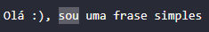

---
## Encontrando Qualquer Dígito de 0 à 9:

    \d

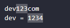

    \d23

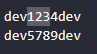

---
## Coringa para Qualquer Tipo de Caracter

    1..

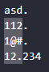

---
## Escapando o Ponto

    \....

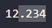

---
## Delimitando a Pesquisa

Encontrar todas as palavras com 3 caracteres no total, que iniciam tanto com "o" ou "a", tanto faz o caractere do meio, e finalizam com a letra "a":

    [oa].[a]

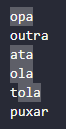

---
## Encontrando uma Combinação Válida de Telefone

    [(]\d\d[)]\d\d\d\d\d[-]\d\d\d\d

---
## Identificando Apenas os Clientes Nacionais com DDI 55

    [5][5][(]\d\d[)]\d\d\d\d\d[-]\d\d\d\d

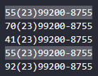

---
## Encontrando Qualquer Combinação que NÃO Inicie com a Letra "v"

    [^v]

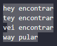

---
## Identificar os Números cujo DDD NÃO seja "55"

    [(][^5][^5][)]\d\d\d\d[-]\d\d\d\d

---
## Identificando uma FAIXA de Valores sem Precisar Digitá-los Individualmente

    [3-7]

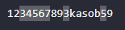

    [e-m]

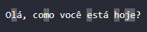

---
## Identificando Caracteres Alfanuméricos (que não contém acentos latinos)

O `\w` representa todas as letras de "a" a "z" em maiúsculo ou minúsculo e também todos os números de 0 a 9.

    \w

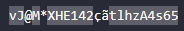

---
## Identificando Caracteres NÃO Alfanuméricos 

    \W

---
## Encontrando Repetições de um Padrão mais Rapidamente

    8{5}

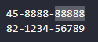

    \d{5}

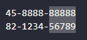

    \d{4,6}

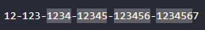

---
## Encontrando um Padrão de Letras Específicas com uma Quantidade X de Repetições

Neste nosso exemplo queremos encontrar os padrõs **zoe** e **zue**:

    [zueo]{3}

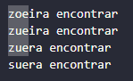

---
## Encontrando um Padrão de Repetição Generalista

    .{8}

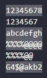

---
## Encontrando Uma ou mais Repetições

O caractere que precede o sinal de ``+`` pode ocorrer 1 ou mais vezes:

    de+

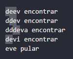

---
## Encontrando Combinações Onde o "Restante" (antes ou depois) pode ser Qualquer Combinação

    enc.*

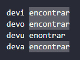

    .*cont

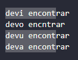

---
## Pode ou Não Ter o Caractere que Precede

Pode ou Não Ter o Caractere que Precede o "?"

    arquivos?

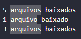

Neste segundo exemplo, a primeira palavra pode ou não estar no plural, porém, a segunda obrigatoriamente tem que estar no plural:

    arquivos? baixados

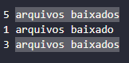

---
## Escapando o "?"

    \?

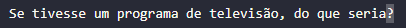

---
## Identificando Espaços em Branco

**Espaço Simples**

    *inserir literalmente um ou mais espaços em branco*

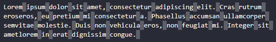

**Nova Linha**

    \n

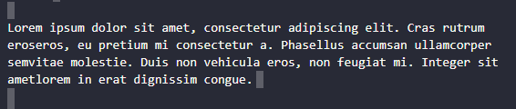

**Tab**

O VSCode não consegue identificar, mas funciona no código:

    \t

**Enter** 

O VSCode não consegue identificar, mas funciona no código:

    \r

**Qualquer Tipo de Espaço em Branco** 

    \s

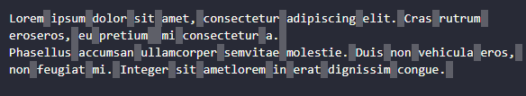

---
## Combinando Caracteres com Espaço em Branco

Padrão que queremos encontrar: _dígito + ponto + um ou mais espaços em branco + olá_

    \d\.\s+olá

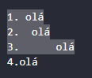

---
## Declarando Inicio e Fim

Utilizamos delimitadores que criam um regex mais preciso:

    ^hora de codar$

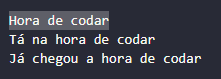

---
## Capturando Grupos

Capturando grupos de caracteres que contenham: _imagem + qualquer sequência de caracteres + ponto + jpg_

    (imagem.+\.)(jpg)

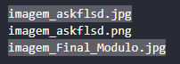

---
## Capturando um Subgrupo

Encontrando e-mails com final **"com OU com.br"** (temos dois subgrupos):

    (\w+)(@\w+\.)(com\.br|com)

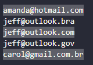

---
## Capturando os 3 Grupos de um Telefone:

    ([(]\d{2}[)])(\d{5})([-]\d{4})

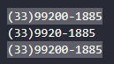