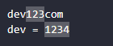
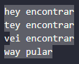
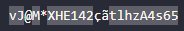
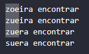
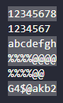

# Guia de Expressões Regulares

**Regex**, **Expressões Regulares** ou **Regular Expression** são padrões utilizados para identificar determinadas combinações caracteres 

## Encontrando o Valor Exato:

    sou

## Encontrando Qualquer Dígito de 0 à 9:

    \d

    \d23

## Coringa para Qualquer Tipo de Caracter

    1..

## Escapando o Ponto

    \....

## Delimitando a Pesquisa

Encontrar todas as palavras com 3 caracteres no total, que iniciam tanto com "o" ou "a", tanto faz o caractere do meio, e finalizam com a letra "a":

    [oa].[a]

## Encontrando uma Combinação Válida de Telefone

    [(]\d\d[)]\d\d\d\d\d[-]\d\d\d\d

## Identificando Apenas os Clientes Nacionais com DDI 55

    [5][5][(]\d\d[)]\d\d\d\d\d[-]\d\d\d\d

## Encontrando Qualquer Combinação que NÃO Inicie com a Letra "v"

    [^v]

## Identificar os Números cujo DDD NÃO seja "55"

    [(][^5][^5][)]\d\d\d\d[-]\d\d\d\d

## Identificando uma FAIXA de Valores sem Precisar Digitá-los Individualmente

    [3-7]

    [e-m]

## Identificando apenas Letras e Números (que não contém acentos latinos)

O `\w` representa todas as letras de "a" a "z" em maiúsculo ou minúsculo e também todos os números de 0 a 9.

## Encontrando Repetições de um Padrão mais Rapidamente

    8{5}

    \d{5}

    \d{4,6}

## Encontrando um Padrão de Letras Específicas com uma Quantidade X de Repetições

Neste nosso exemplo queremos encontrar os padrõs **zoe** e **zue**:

    [zueo]{3}

## Encontrando um Padrão de Repetição Generalista

    .{8}

