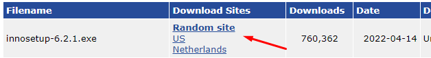
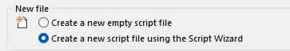

# Criando Instaladores no Windows

## 1º Passo - Criar o Executável com a biblioteca cx-Freeze

## 2º Passo - Baixar o Aplicativo Inno Setup

[Página de Download](https://jrsoftware.org/isdl.php#stable)

## 3º Passo - Instalar o Aplicativo Inno Setup

## 4º Passo - Transformar o Executável em um Instalador

Preencher os dados do programa que será solicitado nas telas seguintes e seguir as demais configurações que serão exibidas.

Esta tela é a mais importante à ser configurada:

Next...

Next...

